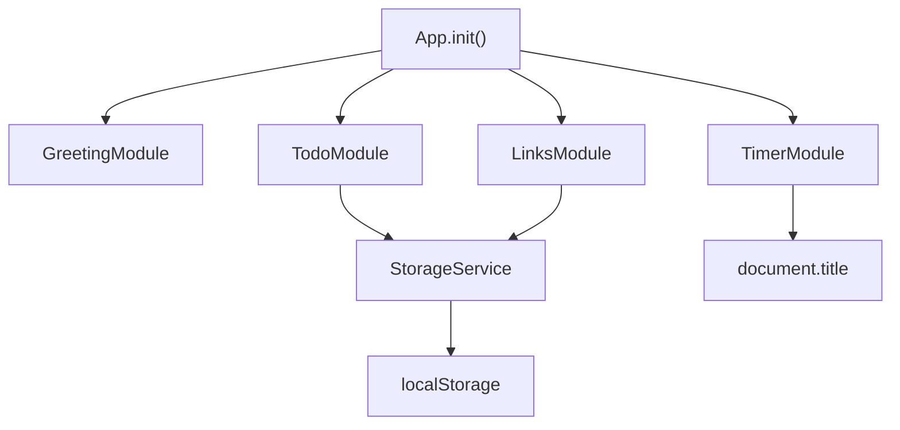

# Design Document

## Overview

The To-Do List Life Dashboard is a single-file, client-side web application with no build step, no framework, and no network dependency. The entire application ships as one `index.html` file that can be opened directly via `file://` or served from any static host.

The application is structured as a lightweight single-page application (SPA) using the **Module Pattern** — each widget is an immediately-invoked or explicitly-initialised JavaScript module object that owns its own DOM subtree, state, and localStorage I/O. A thin `App` coordinator bootstraps the modules in order and wires up any cross-module events.

### Design Goals

- **Zero dependencies** — no CDN, no npm, no build tools.
- **Offline-first** — all functionality works without a network connection.
- **Resilient persistence** — localStorage failures degrade gracefully; the UI always renders.
- **Testable logic** — pure functions (greeting selection, URL normalisation, timer formatting, task filtering) are isolated so they can be exercised by property-based tests without a DOM.

---

## Architecture

### Single-File Structure

```
index.html
├── <head>
│   ├── <meta> (charset, viewport, description)
│   └── <style> (all CSS — custom properties, layout, widget styles, responsive breakpoints)
└── <body>
│   ├── #app-banner          (localStorage warning banner — hidden by default)
│   ├── #greeting-widget     (clock, date, greeting)
│   ├── #timer-widget        (focus timer)
│   ├── #todo-widget         (to-do list)
│   └── #links-widget        (quick links)
└── <script>
    ├── StorageService       (localStorage abstraction)
    ├── GreetingModule       (clock + greeting logic)
    ├── TimerModule          (pomodoro countdown)
    ├── TodoModule           (task CRUD)
    ├── LinksModule          (quick links CRUD)
    └── App.init()           (bootstrap coordinator)
```

### Module Interaction Diagram



### Execution Flow

1. `DOMContentLoaded` fires → `App.init()` runs.
2. `StorageService` probes localStorage availability; sets a flag and shows the warning banner if unavailable.
3. Each module's `init(containerElement)` is called in DOM order.
4. `GreetingModule` starts a `setInterval` (1 s) for the clock.
5. `TodoModule` and `LinksModule` load persisted data from `StorageService`.
6. User interactions are handled entirely within each module via event delegation on the module's root element.

---

## Components and Interfaces

### StorageService

Wraps `localStorage` with error handling. All reads/writes go through this service.

```javascript
StorageService = {
  isAvailable: Boolean,          // set once at init; false if localStorage throws
  get(key) → any | null,         // JSON.parse; returns null on error or missing key
  set(key, value) → Boolean,     // JSON.stringify + setItem; returns false on failure
  remove(key) → void
}
```

- `get` catches `SyntaxError` (corrupt JSON) and `DOMException` (quota/blocked), returns `null`.
- `set` catches `DOMException`; returns `false` so callers can show inline errors.

### GreetingModule

```javascript
GreetingModule = {
  init(container),               // binds DOM refs, starts interval
  _tick(),                       // called every second; updates clock, date, greeting
  _getGreeting(hour) → String,   // pure function — see Greeting Logic below
  _formatTime(date) → String,    // pure — "HH:MM:SS"
  _formatDate(date) → String     // pure — "Weekday, DD Month YYYY"
}
```

### TimerModule

```javascript
TimerModule = {
  init(container),
  _start(),
  _stop(),
  _reset(),
  _tick(),                       // called every second by setInterval
  _formatDisplay(seconds) → String,  // pure — "MM:SS"
  _updateTitle(seconds, isRunning),  // updates document.title
  state: {
    remaining: Number,           // seconds remaining (0–1500)
    isRunning: Boolean,
    isComplete: Boolean
  }
}
```

### TodoModule

```javascript
TodoModule = {
  init(container),
  _addTask(description),
  _deleteTask(id),
  _toggleTask(id),
  _beginEdit(id),
  _commitEdit(id, newText),
  _cancelEdit(id),
  _clearCompleted(),
  _render(),                     // full re-render from state
  _persist(),                    // writes tasks to StorageService
  _load(),                       // reads tasks from StorageService
  state: {
    tasks: Task[],
    editingId: String | null
  }
}
```

### LinksModule

```javascript
LinksModule = {
  init(container),
  _addLink(label, url),
  _deleteLink(id),
  _openLink(id),
  _normalizeUrl(url) → String,   // pure — prepends https:// if needed
  _isValidUrl(url) → Boolean,    // pure — validates scheme + host
  _render(),
  _persist(),
  _load(),
  state: {
    links: Link[]
  }
}
```

### App

```javascript
App = {
  init()   // called on DOMContentLoaded
}
```

---

## Data Models

### Task

```javascript
{
  id:          String,   // crypto.randomUUID() or Date.now().toString() fallback
  description: String,   // non-empty, trimmed
  completed:   Boolean,  // false on creation
  createdAt:   Number    // Date.now() timestamp — used for stable sort on reload
}
```

Stored as a JSON array under the key `tld_tasks`.

### Link

```javascript
{
  id:        String,   // crypto.randomUUID() or Date.now().toString() fallback
  label:     String,   // 1–100 characters, trimmed
  url:       String,   // normalised absolute URL, max 2048 characters
  createdAt: Number    // Date.now() timestamp
}
```

Stored as a JSON array under the key `tld_links`.

### Storage Schema

```
localStorage
├── tld_tasks  →  JSON string of Task[]
└── tld_links  →  JSON string of Link[]
```

---

## State Management

Each module owns its own in-memory state object. There is no shared global state store. The flow for every mutation is:

```
User Event
  → Module event handler
    → Validate input
      → Mutate module.state
        → StorageService.set(key, state.data)
          → Module._render()
```

Re-renders are full DOM replacements of the module's list container (not virtual DOM diffing). Given the expected data sizes (tens of tasks, tens of links), this is fast enough and keeps the code simple.

### ID Generation

```javascript
function generateId() {
  if (typeof crypto !== 'undefined' && crypto.randomUUID) {
    return crypto.randomUUID();
  }
  // Fallback for older Safari / file:// edge cases
  return Date.now().toString(36) + Math.random().toString(36).slice(2);
}
```

---

## Key Algorithms

### Greeting Logic

The greeting is determined by a pure function that maps the current hour (0–23) to a string. The ranges are evaluated in priority order, with "Good Night" taking precedence.

```javascript
function getGreeting(hour) {
  // hour is an integer in [0, 23]
  if (hour >= 21 || hour <= 4)  return "Good Night";
  if (hour >= 18)               return "Good Evening";
  if (hour >= 11)               return "Good Afternoon";
  return "Good Morning";  // hour in [5, 10]
}
```

**Boundary table:**

| Hour range | Greeting       |
|------------|----------------|
| 00–04      | Good Night     |
| 05–10      | Good Morning   |
| 11–17      | Good Afternoon |
| 18–20      | Good Evening   |
| 21–23      | Good Night     |

> Note: Requirements 1.3–1.6 define overlapping boundaries (hour 11 appears in both Morning and Afternoon ranges). The implementation resolves this by checking Night first, then Evening, then Afternoon, so hour 11 maps to "Good Afternoon" and hour 17 maps to "Good Afternoon".

### Timer Countdown

The timer uses `setInterval(tick, 1000)` while running. Each tick decrements `state.remaining` by 1. The interval is stored in a module-scoped variable so it can be cleared on stop/reset.

```javascript
function tick() {
  if (state.remaining <= 0) {
    clearInterval(intervalId);
    state.isRunning = false;
    state.isComplete = true;
    render();
    return;
  }
  state.remaining -= 1;
  render();
}
```

`setInterval` drift is acceptable for a Pomodoro timer (cumulative drift over 25 minutes is typically < 1 second).

### Timer Display Formatting

```javascript
function formatDisplay(totalSeconds) {
  const minutes = Math.floor(totalSeconds / 60);
  const seconds = totalSeconds % 60;
  return String(minutes).padStart(2, '0') + ':' + String(seconds).padStart(2, '0');
}
```

### URL Normalisation

```javascript
function normalizeUrl(raw) {
  const trimmed = raw.trim();
  if (/^https?:\/\//i.test(trimmed)) return trimmed;
  return 'https://' + trimmed;
}

function isValidUrl(url) {
  // Must have scheme + :// + non-empty host
  return /^https?:\/\/.+/i.test(url);
}
```

### Task Filtering (Clear Completed)

```javascript
function clearCompleted(tasks) {
  return tasks.filter(t => !t.completed);
}
```

### Label Truncation (Display Only)

Labels longer than 50 characters are truncated with CSS `text-overflow: ellipsis` on a fixed-width container. No JavaScript truncation is needed; the full label is stored in the data model.

---

## UI Layout and Component Hierarchy

### Layout Strategy

The dashboard uses a single-column layout on narrow viewports and a two-column grid on wider viewports, implemented with CSS Grid.

```
┌─────────────────────────────────────────┐
│  #app-banner (hidden unless storage fail)│
├─────────────────────────────────────────┤
│  #greeting-widget                        │
│    .time-display                         │
│    .date-display                         │
│    .greeting-text                        │
├─────────────────────────────────────────┤
│  #timer-widget                           │
│    .timer-display                        │
│    .timer-controls (Start | Stop | Reset)│
│    .timer-status                         │
├──────────────────┬──────────────────────┤
│  #todo-widget    │  #links-widget        │
│    .todo-input   │    .links-add-form    │
│    .todo-list    │    .links-list        │
│    .todo-actions │                       │
└──────────────────┴──────────────────────┘
```

### Responsive Breakpoints

```css
/* Mobile-first base: single column */
#app-grid {
  display: grid;
  grid-template-columns: 1fr;
  gap: 16px;
  padding: 16px;
}

/* ≥ 768px: greeting + timer full width, todo + links side by side */
@media (min-width: 768px) {
  #app-grid {
    grid-template-columns: 1fr 1fr;
  }
  #greeting-widget,
  #timer-widget {
    grid-column: 1 / -1;
  }
}

/* ≥ 1280px: wider padding, larger font sizes */
@media (min-width: 1280px) {
  #app-grid {
    max-width: 1200px;
    margin: 0 auto;
    padding: 32px;
  }
}
```

### Accessibility

- All interactive controls use `<button>` elements (not `<div>` or `<span>`).
- The timer display uses `role="timer"` and `aria-live="polite"`.
- The storage warning banner uses `role="alert"`.
- Colour contrast ratios meet WCAG 2.1 AA (4.5:1 for normal text, 3:1 for large text).
- Edit mode inputs receive `focus()` programmatically when activated.

---

## Correctness Properties

*A property is a characteristic or behavior that should hold true across all valid executions of a system — essentially, a formal statement about what the system should do. Properties serve as the bridge between human-readable specifications and machine-verifiable correctness guarantees.*

### Property 1: Time format correctness

*For any* `Date` object with a valid time, `_formatTime(date)` SHALL return a string that matches the pattern `HH:MM:SS` (two-digit zero-padded hours, minutes, and seconds), and the encoded hours, minutes, and seconds SHALL equal the corresponding values from the input `Date`.

**Validates: Requirements 1.1**

### Property 2: Date format correctness

*For any* `Date` object with a valid date, `_formatDate(date)` SHALL return a string in the format `"Weekday, DD Month YYYY"` where the weekday name, day number, month name, and year correctly correspond to the input `Date`.

**Validates: Requirements 1.2**

### Property 3: Greeting boundary correctness

*For any* integer hour in [0, 23], `getGreeting(hour)` SHALL return exactly one of the four defined greetings, and the mapping SHALL satisfy all four range rules simultaneously: hours [0–4] and [21–23] → "Good Night"; hours [5–10] → "Good Morning"; hours [11–17] → "Good Afternoon"; hours [18–20] → "Good Evening".

**Validates: Requirements 1.3, 1.4, 1.5, 1.6**

### Property 4: Timer tick decrements remaining by one

*For any* timer state where `remaining > 0` and `isRunning = true`, calling `_tick()` once SHALL decrease `remaining` by exactly 1 and leave all other state fields unchanged.

**Validates: Requirements 2.2**

### Property 5: Timer format round-trip

*For any* integer `s` in [0, 1500], `formatDisplay(s)` SHALL return a string matching `MM:SS` where `MM` and `SS` are zero-padded two-digit numbers, and parsing that string back as `parseInt(MM) * 60 + parseInt(SS)` SHALL equal `s`.

**Validates: Requirements 2.3**

### Property 6: Adding a task grows the list and preserves insertion order

*For any* task list and any non-empty, non-whitespace-only description, adding the task SHALL result in the list length increasing by exactly one, the new task SHALL appear at the end with `completed = false`, and all previously existing tasks SHALL remain in their original relative order with their `id`, `description`, and `completed` values unchanged.

**Validates: Requirements 3.2, 3.4**

### Property 7: Whitespace-only input is rejected for both task creation and task editing

*For any* string composed entirely of whitespace characters (spaces, tabs, newlines), (a) attempting to add it as a new task description SHALL leave the task list unchanged, and (b) attempting to commit it as an edited task description SHALL leave the task's original description unchanged.

**Validates: Requirements 3.3, 4.3**

### Property 8: Storage round-trip preserves task data

*For any* array of Task objects, serialising the array to JSON via `StorageService.set('tld_tasks', tasks)` and then reading it back via `StorageService.get('tld_tasks')` SHALL produce an array where each task has the same `id`, `description`, `completed`, and `createdAt` values as the original, in the same order.

**Validates: Requirements 3.5, 3.6, 8.1, 8.3**

### Property 9: Only one task is in edit mode at a time

*For any* task list with at least one task, after calling `_beginEdit(id)` for any valid task `id`, the module's `editingId` SHALL equal that `id`, and no other task SHALL be in an editable UI state; calling `_beginEdit` on a second task while the first is being edited SHALL move edit mode to the second task.

**Validates: Requirements 4.1**

### Property 10: Task toggle is an involution

*For any* task, toggling its completion state twice SHALL return it to its original completion state (i.e., `toggleTask(toggleTask(task)).completed === task.completed`).

**Validates: Requirements 4.5**

### Property 11: Deletion removes exactly the targeted item

*For any* non-empty list of tasks or links and any valid `id` in that list, deleting the item with that `id` SHALL produce a list that (a) does not contain any item with that `id`, (b) has length equal to the original length minus one, and (c) preserves all other items in their original relative order.

**Validates: Requirements 5.2, 7.4**

### Property 12: Clear completed removes only completed tasks

*For any* task list, after calling `clearCompleted`, the resulting list SHALL contain no tasks with `completed = true`, and every task that had `completed = false` before the call SHALL still be present with its `id`, `description`, and `createdAt` unchanged, in the same relative order.

**Validates: Requirements 5.4**

### Property 13: Adding a link grows the list

*For any* links list and any valid (non-empty label, valid URL) pair within the allowed length limits, adding the link SHALL result in the list length increasing by exactly one, and the new link SHALL appear at the end with the normalised URL stored.

**Validates: Requirements 7.2**

### Property 14: Link validation rejects out-of-bounds inputs

*For any* label string with length > 100 characters, or any URL string with length > 2048 characters, or any empty label or empty URL, the `_addLink` validation SHALL reject the submission and leave the links list unchanged.

**Validates: Requirements 7.3**

### Property 15: URL normalisation idempotence

*For any* URL string, applying `normalizeUrl` twice SHALL produce the same result as applying it once: `normalizeUrl(normalizeUrl(url)) === normalizeUrl(url)`.

**Validates: Requirements 7.5**

### Property 16: URL normalisation preserves existing schemes

*For any* URL string that already begins with "http://" or "https://" (case-insensitive), `normalizeUrl` SHALL return the string unchanged.

**Validates: Requirements 7.5**

### Property 17: Valid URL consistency through normalisation

*For any* URL string where `isValidUrl(url)` returns `true`, `isValidUrl(normalizeUrl(url))` SHALL also return `true` — normalisation SHALL never invalidate a URL that was already valid.

**Validates: Requirements 7.6**

### Property 18: Storage round-trip preserves link data

*For any* array of Link objects, serialising the array to JSON via `StorageService.set('tld_links', links)` and then reading it back via `StorageService.get('tld_links')` SHALL produce an array where each link has the same `id`, `label`, `url`, and `createdAt` values as the original, in the same order.

**Validates: Requirements 8.2, 8.3**

---

## Error Handling

### localStorage Unavailability

Detected once at startup by `StorageService.init()`:

```javascript
function probeStorage() {
  try {
    const probe = '__tld_probe__';
    localStorage.setItem(probe, '1');
    localStorage.removeItem(probe);
    return true;
  } catch (e) {
    return false;
  }
}
```

If unavailable, `StorageService.isAvailable = false` and the app shows a persistent `role="alert"` banner. All modules continue to function in-memory for the session.

### Corrupt JSON on Load

`StorageService.get` wraps `JSON.parse` in a try/catch. On `SyntaxError`, it returns `null`. Modules treat `null` as an empty list and start fresh — no partial state is retained.

### Write Failures

`StorageService.set` returns `false` on `DOMException` (quota exceeded, etc.). Callers check the return value:

- **TodoModule delete**: if `set` returns `false`, the task is removed from the visible list but an inline error message is shown: "Could not save — deletion may reappear on reload."
- **LinksModule add/delete**: similar inline error on the affected link or form.

### Invalid Clock

`GreetingModule._tick` wraps `new Date()` in a guard:

```javascript
const now = new Date();
if (isNaN(now.getTime())) {
  showPlaceholder();
  return;
}
```

### URL Open Failure

`LinksModule._openLink` calls `window.open(url, '_blank')`. If the return value is `null` (popup blocked) or the URL fails the `isValidUrl` check, an inline per-link error is shown and persists until the user re-activates or dismisses it.

---

## Testing Strategy

### Approach

Because this is a zero-dependency, single-file application, tests are written as a separate test HTML file (`tests.html`) that imports the pure-function modules via `<script>` tags and runs assertions using a minimal property-based testing harness.

**Recommended library**: [fast-check](https://fast-check.io/) loaded from a local copy (no CDN) for property-based tests. For unit tests, a minimal hand-rolled `assert` helper is sufficient.

### Unit Tests

Unit tests cover specific examples, edge cases, and error conditions:

- `getGreeting` at each boundary hour (0, 4, 5, 10, 11, 17, 18, 20, 21, 23)
- `formatDisplay(0)` → `"00:00"`, `formatDisplay(1500)` → `"25:00"`, `formatDisplay(90)` → `"01:30"`
- `normalizeUrl` with and without existing scheme
- `isValidUrl` with valid and invalid inputs
- `clearCompleted` with mixed, all-complete, and all-incomplete lists
- `StorageService.get` with corrupt JSON input
- Task edit: confirm with empty string restores original description

### Property-Based Tests

Each correctness property from the design document is implemented as a single property-based test with a minimum of 100 iterations. Tests are tagged with the property they validate.

| Test | Property | Library Arbitraries |
|------|----------|---------------------|
| Time format correctness | Property 1 | `fc.date()` |
| Date format correctness | Property 2 | `fc.date()` |
| Greeting boundary correctness | Property 3 | `fc.integer({min:0, max:23})` |
| Timer tick decrements remaining | Property 4 | `fc.integer({min:1, max:1500})` |
| Timer format round-trip | Property 5 | `fc.integer({min:0, max:1500})` |
| Adding a task grows list and preserves order | Property 6 | `fc.array(taskArb)`, `fc.string().filter(s => s.trim().length > 0)` |
| Whitespace input rejected (add + edit) | Property 7 | `fc.stringOf(fc.constantFrom(' ', '\t', '\n', '\r'))` |
| Task storage round-trip | Property 8 | `fc.array(taskArb)` |
| Only one task in edit mode | Property 9 | `fc.array(taskArb, {minLength: 1})` |
| Task toggle is involution | Property 10 | `taskArb` |
| Deletion removes exactly the targeted item | Property 11 | `fc.array(taskArb, {minLength: 1})` (and `linkArb`) |
| Clear completed correctness | Property 12 | `fc.array(taskArb)` |
| Adding a link grows the list | Property 13 | `fc.array(linkArb)`, valid label+URL arbitraries |
| Link validation rejects out-of-bounds inputs | Property 14 | `fc.string({minLength: 101})` for label, `fc.string({minLength: 2049})` for URL |
| URL normalisation idempotence | Property 15 | `fc.string()` |
| URL normalisation preserves existing schemes | Property 16 | `fc.oneof(fc.constant('http://'), fc.constant('https://')).chain(s => fc.string().map(r => s + r))` |
| Valid URL consistency through normalisation | Property 17 | `fc.string()` |
| Link storage round-trip | Property 18 | `fc.array(linkArb)` |

**Tag format**: `// Feature: todo-life-dashboard, Property N: <property_text>`

### Integration / Smoke Tests

- Open `index.html` in each target browser; verify all four widgets render.
- Verify localStorage keys `tld_tasks` and `tld_links` are written after adding a task/link.
- Verify the app renders correctly with localStorage disabled (private browsing mode).
- Verify the app renders correctly at 320 px, 768 px, 1280 px, and 2560 px viewport widths.
